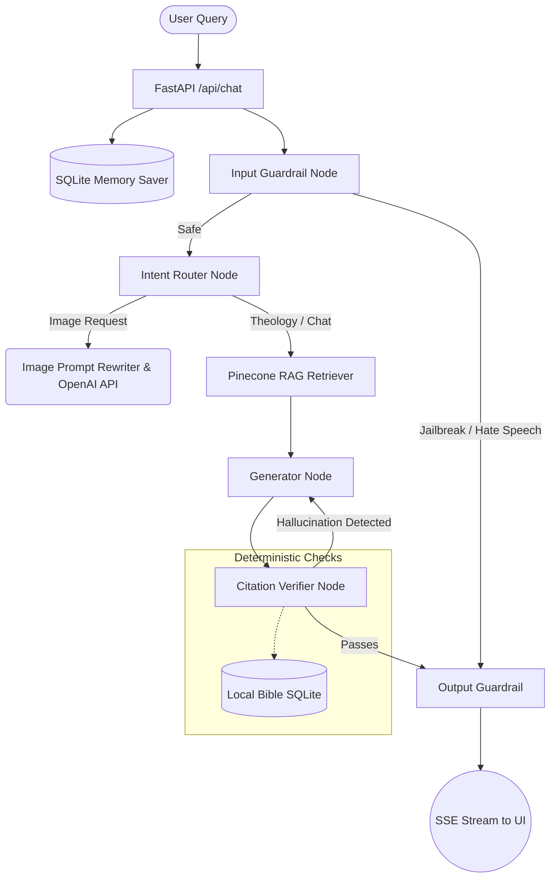

# ChristianAI Theological Assistant

A multi-agent AI system designed for Christian theological Q&A. This project focuses on **deterministic hallucination prevention**, denomination-aware RAG retrieval, and strict safety guardrails to ensure scriptural accuracy and theological reverence.

[](./backend/evals/eval_results.md)
[](https://python.org)
[](https://fastapi.tiangolo.com)

---

## Architecture

The system utilizes LangGraph to orchestrate a cyclic workflow between generation and deterministic verification.



### Architecture Decision Records (ADRs)

| Decision | Choice | Rationale |
| :--- | :--- | :--- |
| **Orchestration** | **LangGraph** | Enables cyclic graphs, essential for the Generator → Verifier → Generator correction loop. Provides native asynchronous checkpointing. |
| **Primary LLM** | **GPT-4o-mini** | Handles orchestration, intent routing, and generation. Chosen for speed, cost-efficiency, and strict formatting adherence. |
| **Vector DB** | **Pinecone Serverless** | Provides high-performance similarity search with metadata filtering for denomination-specific commentary. |
| **Verification** | **Deterministic SQLite** | Since LLMs inevitably hallucinate, scripture validation is decoupled from the LLM and enforced via direct database queries. |
| **Memory** | **AsyncSqliteSaver** | State persistence across server reloads and user sessions. |
| **Backend** | **FastAPI + Pydantic v2** | Async event streaming (SSE), strict data validation, and auto-generated OpenAPI documentation. |
| **Frontend** | **Vanilla JS + CSS** | Decoupled static assets served directly by FastAPI. Zero build steps required. |

---

## Deterministic Hallucination Prevention

A core requirement of this system is to mathematically guarantee that all cited scripture actually exists. 

1. **Regex Extraction**: The pipeline post-processes the LLM's draft to extract all scripture references (e.g., `[Book Chapter:Verse]`).
2. **Deterministic Lookup**: The extracted citations are queried against a local `bible.db` SQLite database.
3. **Correction Loop**: If a book or chapter does not exist (e.g., "1 Hezekiah 4:5"), the verification node intercepts the response, drafts a corrective prompt, and forces the generator to rewrite the response before streaming it to the client.

---

## Key Features

- **Citation Verification**: Completely eliminates scriptural hallucinations using cyclic LangGraph nodes.
- **Denomination-Aware RAG**: Applies metadata filters to tailor theological context (Catholic, Protestant, Orthodox).
- **Safety Guardrails**: Implements a multi-layered defense (Input Guard + Output Toxicity checks) to reject adversarial prompts or hate speech.
- **Image Generation Pipeline**: Intercepts image requests and rewrites prompts to ensure iconographic reverence before passing them to the image API.
- **Persistent Sessions**: Conversation history is maintained asynchronously via SQLite checkpointing.
- **Automated Evaluation Suite**: Includes 40 hard-coded test cases evaluating QA accuracy, hallucination triggers, and safety boundaries.

---

## Local Setup

### Prerequisites
- Python 3.11+
- API keys: OpenAI, Pinecone (see `.env.example`)

### 1. Clone & Configure
```bash
git clone https://github.com/Dhiraj274/christian-ai-assistant.git
cd christian-ai-assistant
cp .env.example .env
# Edit .env with your API keys
```

### 2. Install Dependencies
```bash
python -m venv venv
source venv/bin/activate  # On Windows: venv\Scripts\activate
pip install -r requirements.txt
```

### 3. Start the Application
```bash
uvicorn backend.main:app --reload --port 8000
```
*Note: The repository includes a pre-populated `bible.db` containing seed verses for instant local testing.*

Navigate to `http://localhost:8000` in your browser.

### Docker Support
You can also run the entire stack via Docker:
```bash
docker-compose up --build
```

---

## Evaluation Suite

The repository contains an automated LLM-as-a-judge evaluation suite to test system regressions.

```bash
# Run the full 39-question test suite
python -m backend.evals.run_evals
```

| Eval Category | Target Pass Rate |
| :--- | :---: |
| General Theological Q&A | 100% |
| Hallucination Rejection | 100% |
| Denomination Context | 100% |
| Adversarial Refusal | 100% |
| Edge Cases | 100% |

---

## Deployment

This application is containerized and optimized for deployment on Docker-compatible cloud providers.

**Hugging Face Spaces (Docker SDK):**
1. Create a new Docker Space.
2. Upload this repository.
3. Add your `.env` variables as Secrets.
4. The Space will automatically build and host the application.
